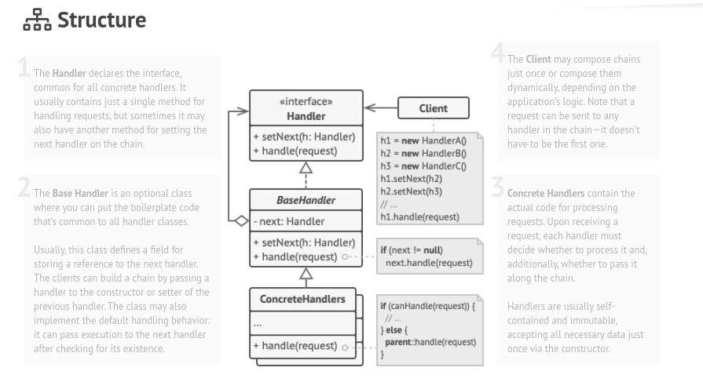

# Chain Of Responsibility

### Intent :

#### Lets you pass requests along a chain of handlers. Upon receiving a request, each handler decides either to process the request or to pass it to the next handler in the chain.

#### Summery : 
- The chain of responsibility pattern is used to process varied requests, based on their nature.
- The pattern allows you to add new request types without modifying existing classes.
- The pattern is also used to avoid coupling the sender of a request to its receiver, which may vary greatly from one request to another.
- The pattern is also used to define a flexible alternative for request dispatching.

