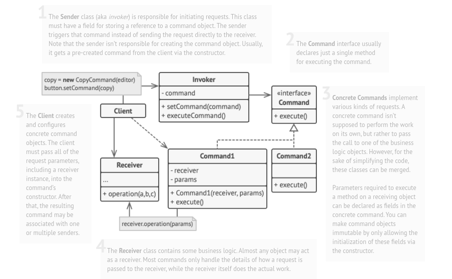

# Command

## Also known as: Action, Transaction, Request

### Intent :

#### Let that turns a request into a stand-alone object that contains all information about the request. This transformation lets you pass requests as a method arguments, delay or queue a request’s execution, and support undoable operations.

#### Summery :
- It is a wrapper around a request that provides a standard interface for creating and executing commands.

