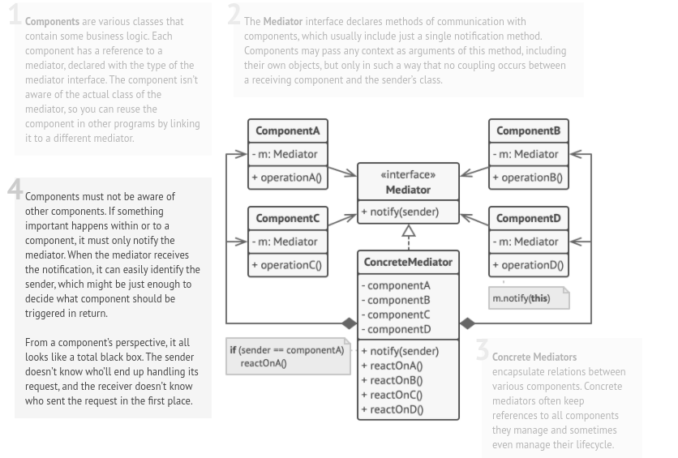

# Mediator

## Also known as: Intermediary, Controller

### Intent :

#### That lets you reduce chaotic dependencies between objects. The pattern restricts direct communications between the objects and forces them to collaborate only via a mediator object.

#### Summery :
- The pattern can be used to:
    - Encapsulate complicated inter-dependencies between objects into a single object.
    - Provide a flexible alternative to using inheritance to control object communication.
    - Provide a way to define new types of relationships without changing classes.

