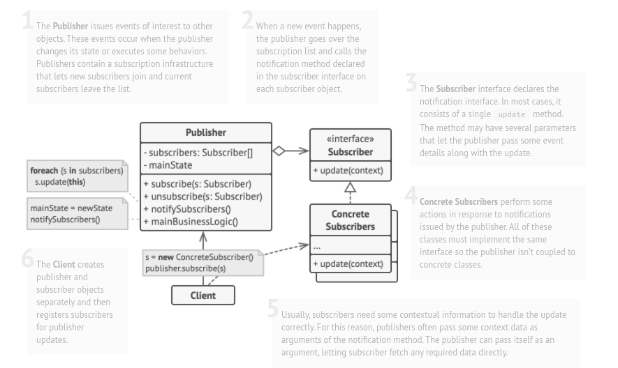

# Observer

## Also known as: Listener

### Intent :

#### Lets you define a subscription mechanism to notify multiple objects about any events that happen to the object they’re observing.

#### Summery : 
- The observer pattern is used to allow an object to publish notifications of changes to its state.

