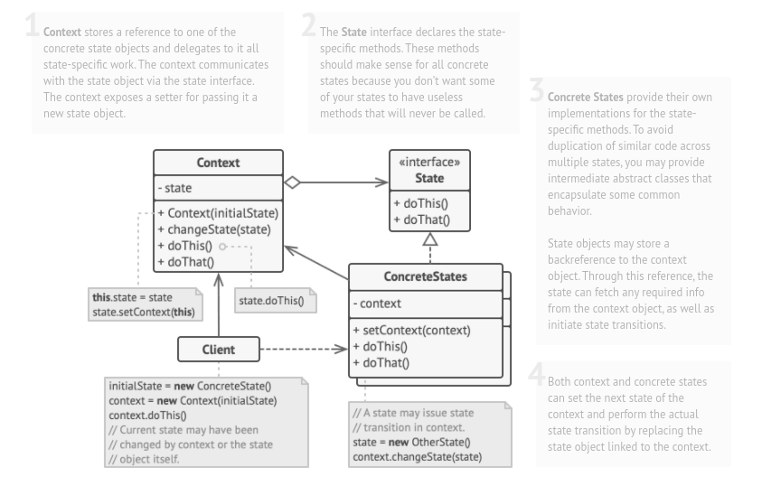

# State

### Intent :

####  Lets an object alter its behavior when its internal state changes. It appears as if the object changed its class.

#### Summery :
- The pattern allows the same object to be used in different states.

