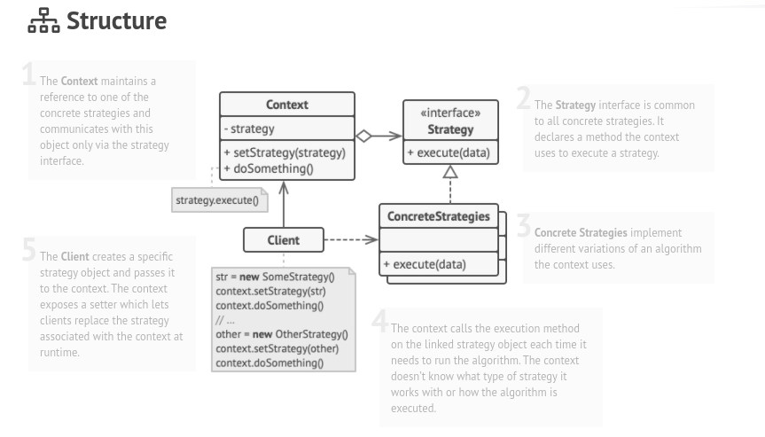

# Strategy

### Intent :

#### Lets you define a family of algorithms, put each of them into a separate class, and make their objects interchangeable.

#### Summery : 
- Strategy pattern is used to solve the problem of varying algorithms.
- Strategy pattern is used when you need to use different algorithms in your program.

