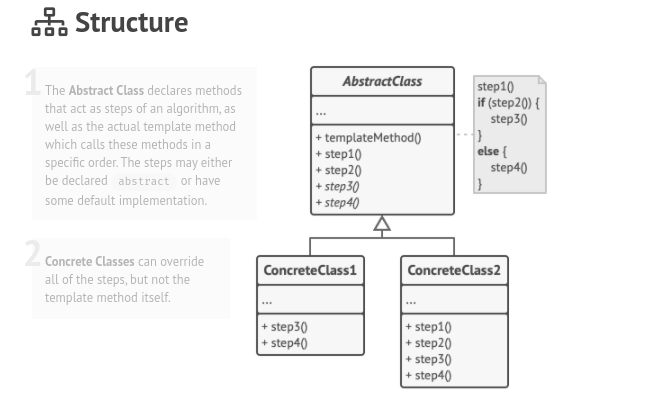

# Template Method

### Intent :

#### Let that defines the skeleton of an algorithm in the superclass but lets subclasses override specific steps of the algorithm without changing its structure.

#### Summery :
- Template Method lets subclasses redefine certain steps of an algorithm without changing the algorithm's structure.

