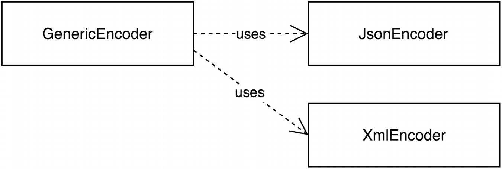

# Open / Close Principle

## Intent

### You should be able to extend a class's behavior without modifying it.

#### Two Different Perspectives
- Reduce amount of changes to the code base
- Backwards compatibility

#### Variation of the Open Close Principle
- It contains conditions to determine a strategy.
- Condition using the same variables or constants are recurring inside the class or related classes.
- The class contains hard-coded references to other classes or class names.
- Inside the class, object are being created using the new operator.
- The class has protected properties and methods, to allow changing its behavior by overriding state or behavior.

