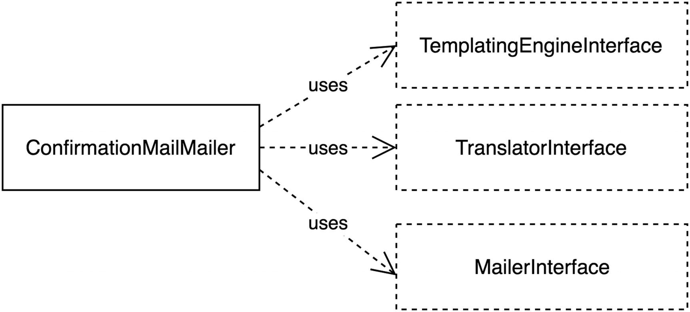

# Single Responsibility Principle

## Intent

### A class should have one, and only one, reason to change.

#### Variation of the Single Responsibility Principle
- There are too many instance variables in the class.
- There are too many public methods in the class.
- Each method of the class uses different instance variables.
- Specific tasks are delegated to private methods.

