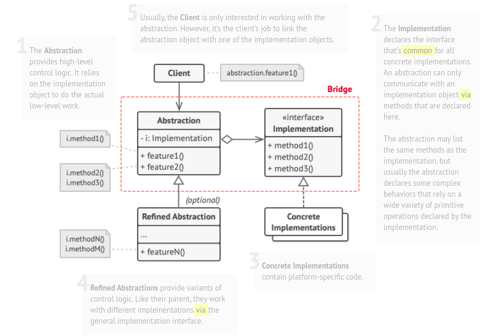

# Bridge

### Intent :

#### That lets you split a large class or a set of closely related classes into two separate hierarchies—abstraction and implementation—which can be developed independently of each other.

#### Summery : 
- Decouple an abstraction from its implementation so that the two can vary independently.

