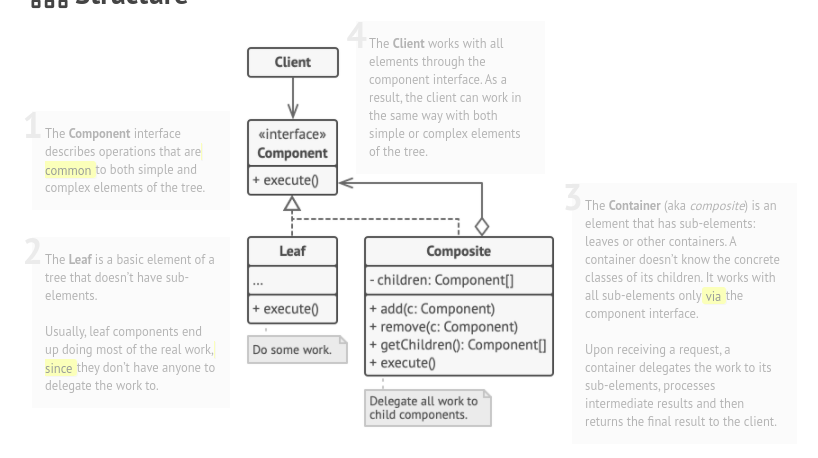

# Composite

## Also known as "Object Tree"

### Intent :

#### That lets you compose objects into tree structures and then work with these structures as if they were individual objects.

#### Summery : 
- A tree structure is a hierarchical structure in which each node is either a leaf or a branch.
- A leaf is a node that contains no other nodes.
- A branch is a node that contains other nodes.

