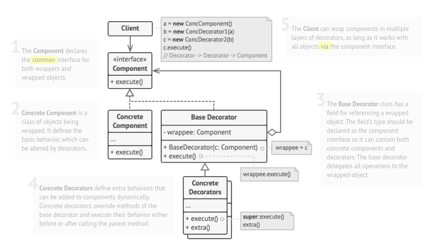

# Decorator

## Also known as "Wrapper"

### Intent :

#### That lets you attach new behaviors to objects by placing these objects inside special wrapper objects that contain the behaviors.

#### Summery : 
- Attaches additional responsibilities to an object dynamically
- The wrapper object is responsible for executing the behavior it contains.

