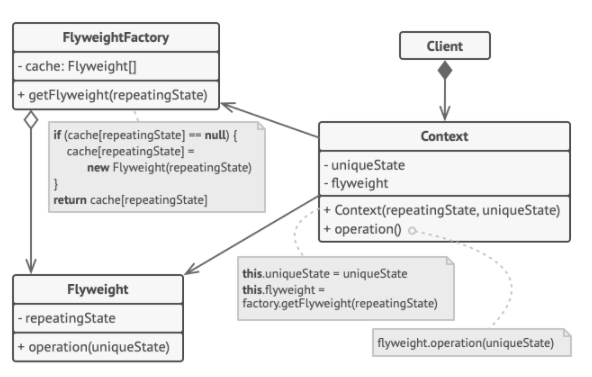

# Flyweight

## Also known as "Cache"

### Intent :

#### Flyweight is a structural design pattern that lets you fit more objects into the available amount of RAM by sharing common parts of state between multiple objects instead of keeping all the data in each object.

#### Summery : Optimize memory(RAM) consumption in a large number of objects

