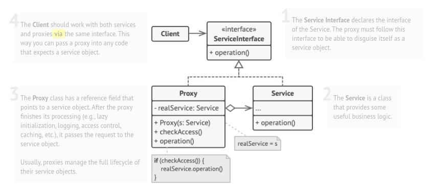

# Proxy

### Intent :

#### A proxy controls access to the original object, allowing you to perform something either before or after the request gets through to the original object.

#### Summery : 
- Lazy initialization: The proxy is created only when it is needed.(Heavyweight service or expensive service) 
- Access control: The proxy controls access to the original object. (Security service)
- Caching: The proxy can cache the return value of the original object.(Results are quite large and expensive to compute.)

